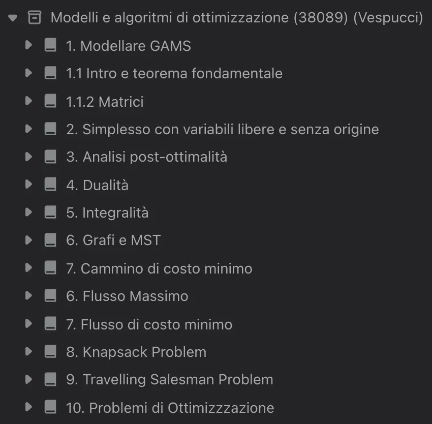
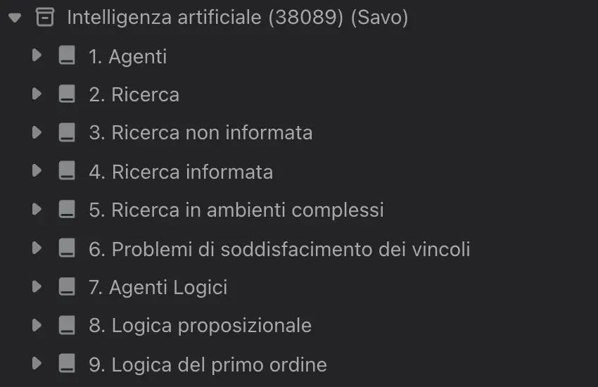

# Flashcard e appunti per la laurea magistrale in Ingegneria Informatica presso UniBG (LM-32)

Questa repo contiene le flashcard e gli appunti che ho scritto studiando ingegneria informatica presso l'Università degli Studi di Bergamo. I corsi si sono svolti nell'anno accademico 2023/2024 per il primo anno e 2024/2025 per il secondo. Metto tutto a disposizione sperando che a qualcuno possa essere utile.

> [!WARNING]
> Non do nessuna garanzia che questo materiale sia esaustivo o completamente corretto. Vi consiglio di usarlo come ripasso dopo che avrete già studiato la lezione e non come unico modo per preparare gli esami, poiché rischiereste solo di overfittare la vostra preparazione.

# 📝 Flashcard
Ho realizzato queste fleshards usando <a href='https://mochi.cards' target='blank'>Mochi</a>, un software che aiuta anche a gestire lo studio e il ripasso permettendo di fare testing attraverso l'applicazione del principio delle spaced repetition. Mochi ha sia una versione free che una premium ma la maggiorparte delle feature sono disponibili nella versione free, ciò che è aggiunto dall'abbonanamento mensile è il backup e la sincronizzazione tra dispositivi. Potete cominciare già da subito ad usare Mochi dalla <a href='https://app.mochi.cards' target='blank'>webapp</a> senza neppure dover creare un account. Una volta fatto l'accesso è sufficiente scaricare il deck che vi interessa e importarlo in Mochi, chiaramente chiudendo la sessione vengono persi tutti i deck e le modifche ma potete sempre esportarle in formato .mochi e averle a disposizine in locale. Esistono poi versioni in locale della app per MacOS, Windows, iOS ecc. Importato il deck potere ripeterne le card all'interno selezionando "cram".

## Struttura di un Deck
Per ogni argomento trovate un deck dentro il quale sono presenti tanti sotto-deck quanti sono gli argomenti trattati nel corso. In questo modo si può decidere se esercitarsi sia su deck completo o su un di un singolo argomento. 

  
  

# ✍🏻 Appunti
Ho realizzato questi appunti scrivendo a mano su di un iPad con Apple Pencil usando <a href='https://mochi.cards' target='blank'>Notability</a>. Metto a disposizione gli appunti in formato PDF di modo che non sia necessario scaricare la app, ma nel caso potessero servirvi nel formato proprietario di Notability (`.note`) contattatemi e sperate che non abbia cancellato tutto in un impeto di Marie Kondismo.

## Struttura di un appunto
Gli appunti che prendo seguono la struttura di uno schema lineare e sono scritti a mano su un foglio formattato similmente a ciò che si può trovare nel metodo cornell: il contenuto principale al centro, domande/osservazioni/parole chiave a destra e un titolo in alto per ogni pagina.

# 🤓 Consigli per il metodo di studio
Il metodo di studio per il quale ho relizzato questo materiale si basa sul metodo P.A.C.R.A.R. (Pianificazione, Acquisizione, Comprensione, Rielaborazione, Applicazione, Ricordo) delineato da Alessando de Concini sui suoi libri, corsi e altri contenuti online. Si tratta di un metodo basato sul testing delle proprie conoscenze attraverso l'applicazione dei concetti studiati: ciò può essere fatto con esercizi o domande, ecco che subentrano le flashcards. L'effetto del ripasso è poi ulteriormente accresciuto se si esegue testing a intervalli precisi seguendo il principio delle "spaced repetition".
Mentre seguivo i corsi ho di volta in volta studiato la lezione precedente e scritto le flashcard in Mochi iniziando da quel momento a ripassare ogni giorno quello che la app mi forniva in base agli intervalli che avevo settato.
## Alcune fonti utili se voleste approfondire
<ul>
<li> <a href='https://www.alessandrodeconcini.com/metodo-di-studio/costruire-metodo-studio-perfetto'>Come costruire il metodo di studio perfetto</a>
<li> <a href='https://www.feltrinellieditore.it/opera/vince-chi-impara/'>Vince chi impara (Alessandro de Concini)</a>
<li> <a href='https://www.google.com/url?sa=t&source=web&rct=j&opi=89978449&url=https://barbaraoakley.com/books/a-mind-for-numbers/'>A mind for numbers (Barbara Oakley)</a>
<li> <a href='https://www.google.com/url?sa=t&source=web&rct=j&opi=89978449&url=https://barbaraoakley.com/books/learn-like-a-pro/'>Learn Like a Pro (Barbara Oakley)</a>
<li> <a href='https://www.google.com/url?sa=t&source=web&rct=j&opi=89978449&url=https://barbaraoakley.com/books/learning-how-to-learn/'>Learning How to Learn (Barbara Oakley)</a>
</ul>

> [!NOTE]
> Non sono pakato da Alessandro de Concini o in alcun modo affiliato con la sua compagnia, così come non sono affiliato a Notability o Mochi. Semplicemente mi piace il loro lavoro.

# 1️⃣ Corsi obbligatori del primo anno

### Gestione Aziendale (38024) - Albachiara Boffelli
<a href='https://github.com/FI-153/flashcards-unibg-ingegneria-informatica/blob/000ba488fec6cb86346d7b56c11253688e761093/Gestione%20aziendale%20(38024)%20(Boffelli).mochi'>Scarica il deck</a> 
<a href=''>Scarica gli appunti</a>

### Identificazione dei modelli e analisi dei dati (IMAD) (38020) (38011) - Mirco Mazzoleni
<a href='https://github.com/FI-153/flashcards-unibg-ingegneria-informatica/blob/000ba488fec6cb86346d7b56c11253688e761093/Identificazione%20dei%20modelli%20e%20analisi%20dei%20dati%20(38020)%20(38011)%20(Mazzoleni).mochi'>Scarica il deck</a> 
<a href=''>Scarica gli appunti</a>

### Intelligenza artificiale (38089) - Domenico Fabio Savo
<a href='https://github.com/FI-153/flashcards-unibg-ingegneria-informatica/blob/000ba488fec6cb86346d7b56c11253688e761093/Intelligenza%20artificiale%20(38089)%20(Savo).mochi'>Scarica il deck</a> 
<a href=''>Scarica gli appunti</a>

### Modelli e algoritmi di ottimizzazione (MAO) (38089) - Maria Teresa Vespucci
<a href='https://github.com/FI-153/flashcards-unibg-ingegneria-informatica/blob/000ba488fec6cb86346d7b56c11253688e761093/Modelli%20e%20algoritmi%20di%20ottimizzazione%20(38089)%20(Vespucci).mochi'>Scarica il deck</a> 
<a href=''>Scarica gli appunti</a>

### Progettazione, algoritmi e computabilità (PAC) (38090) - Patrizia Scandurra
<a href='https://github.com/FI-153/flashcards-unibg-ingegneria-informatica/blob/000ba488fec6cb86346d7b56c11253688e761093/Progettazione%2C%20algoritmi%20e%20computabilit%C3%A0%20(38090)%20(Scandurra).mochi'>Scarica il deck</a> 
<a href=''>Scarica gli appunti</a>

### Programmazione avanzata (38090) - Claudio Menghi
<a href='https://github.com/FI-153/flashcards-unibg-ingegneria-informatica/blob/000ba488fec6cb86346d7b56c11253688e761093/Programmazione%20avanzata%20(38090)%20(Menghi).mochi'>Scarica il deck</a> 
<a href=''>Scarica gli appunti</a>

### Reti di telecomunicazione (Principi e Laboratorio) (39092) - Fabio Martignon
<a href='https://github.com/FI-153/flashcards-unibg-ingegneria-informatica/blob/000ba488fec6cb86346d7b56c11253688e761093/Reti%20di%20telecomunicazione%20(Principi%20e%20Laboratorio)%20(39092)%20(Martignon).mochi'>Scarica il deck</a> 
<a href=''>Scarica gli appunti</a>

### Teoria dell'informazione e della trasmissione (TIT) (38011) (38092) - Marco Pietro Giuseppe Ferrari 
<a href="https://github.com/FI-153/flashcards-unibg-ingegneria-informatica/blob/4f8a5627a42302da5a1c847cd839773518ea186c/Teoria%20dell'informazione%20e%20della%20trasmissione%20(TIT)%20(38011)%20(38092)%20(Ferrari).mochi"> Scarica il deck</a> 
<a href=''>Scarica gli appunti</a>

# 1️⃣ Corsi a scelta del primo anno

### Machine Learning (38094) - Daniele Gamba
<a href='https://github.com/FI-153/flashcards-unibg-ingegneria-informatica/blob/000ba488fec6cb86346d7b56c11253688e761093/Machine%20Learning%20(38094)%20(Gamba).mochi'>Scarica il deck</a> 
<a href=''>Scarica gli appunti</a>
